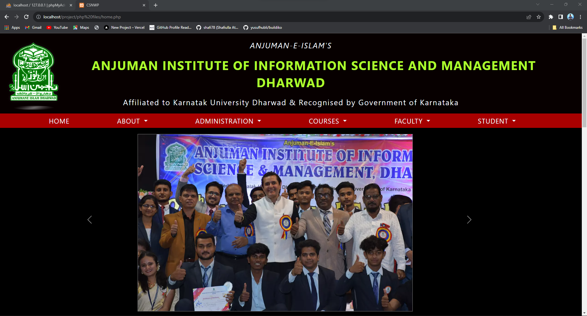

# Mini Project 1 : CSNWP 

# <a href="https://www.linkedin.com/posts/shafiulla-attar-b4a716252_webdeveloper-fullstackdevelopment-php-activity-7119320716650418176-psRA?utm_source=share&utm_medium=member_desktop">Demo Video</a>

college social networking web project ( My first project )

Simple social networking web app created among students & Faculty.

Advantages :

* Students will be updated with new thoughts and views
* Students can share as well as obtain knowledge by using this application
* Proper notes management is provided

Some mistakes I realized after doing this project :

1. Lack of Comments and Documentation
2. Inconsistent Naming Conventions
3. Code Duplication
4. Not Handling Errors Properly
5. Ignoring Testing
6. Ignoring Security Concerns
7. Not Following DRY (Don't Repeat Yourself) Principle
8. Ignoring Code Style and Formatting Guidelines
9. Using Global Variables
10. Poorly Structured Code
11. Ignoring Version Control
12. Ignoring Performance Considerations
13. Missing of Responsiveness
14. Inline styling
15. Lack of functions & components
